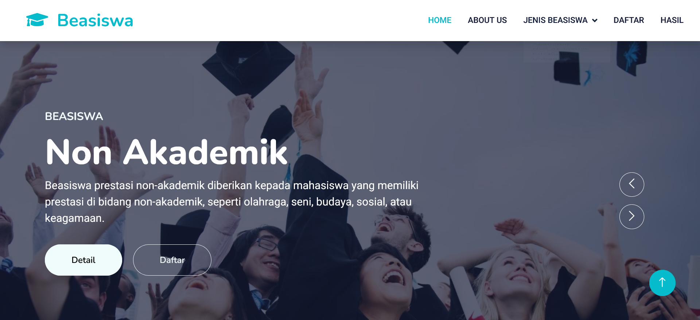
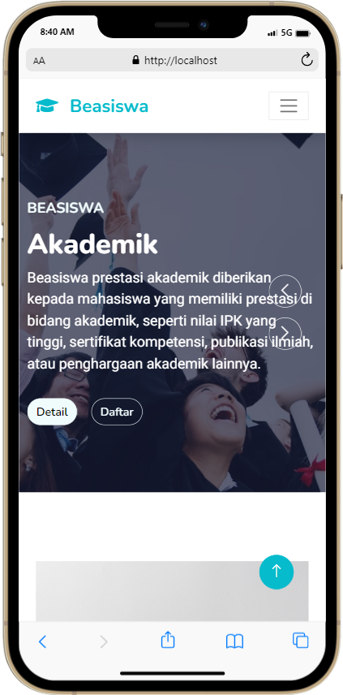

# Penjelasan singkat tentang webiste ini

## Tentang project
Pada project ini, saya membuat website Pendaftaran Beasiswa sebagai project dari Uji Kompetensi BNSP Junior Web Developer yang dilaksanakan oleh digitalen kominfo yang bekerjasama dengan LSP Informatika. Saya membuat website ini menggunakan HTML, CSS, JS, PHP dan Bootstrap. Website ini juga sudah responsif❗️

## Login admin 
### http://localhost/namafolder/admin 
Username: **admin** 
Passoword: **admin** 

## Screenshot
Berikut adalah screenshot project saya:

### Tampilan dekstop
 

### Tampilan mobile

# Unit Kompetensi yang diperlukan
1. Mengimplementasikan User Interface
2. Menerapkan Perintah Eksekusi Bahasa Pemrograman Berbasis Teks, Grafik, dan Multimedia
3. Menyusun Fungsi, File atau Sumber Daya Pemrograman yang Lain dalam Organisasi yang Rapih
4. Menulis Kode dengan Prinsip Sesuai Guidelines dan Best Practices
5. Mengimplementasikan Pemrograman Terstruktur
6. Menggunakan Library atau Komponen Pre-Existing

# Akhir kata
Dikembangkan oleh 
([@azharangga_kusuma](https://instagram.com/azharangga_kusuma))
